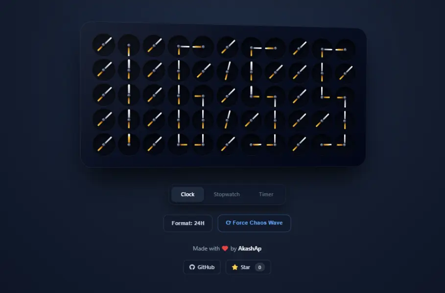

# 🕰️ Kinetic Clock

A premium, 3D interactive kinetic digital clock built with HTML, CSS, and pure JavaScript. It features mechanical sweeping animations, continuous mathematical digit mapping, a stopwatch, and a countdown timer—all wrapped in a neumorphic, luxury watch aesthetic.

## ✨ Features
* **Mechanical Wave Animations:** Staggered, physical-feeling motor sweeps.
* **3D Parallax Tilt:** The chassis dynamically tracks and reacts to mouse movement.
* **Multiple Modes:** Fully functional Clock, Stopwatch, and Timer.
* **Zero Dependencies:** Smooth 60fps physics animations using pure CSS and JS.

## 🚀 Check out my other work!
* **🍞 Toast Anchor (My NPM Package):** [https://toast-anchor.vercel.app/](https://toast-anchor.vercel.app/)
* **👨‍💻 My Portfolio:** [https://akashap.vercel.app/](https://akashap.vercel.app/)
